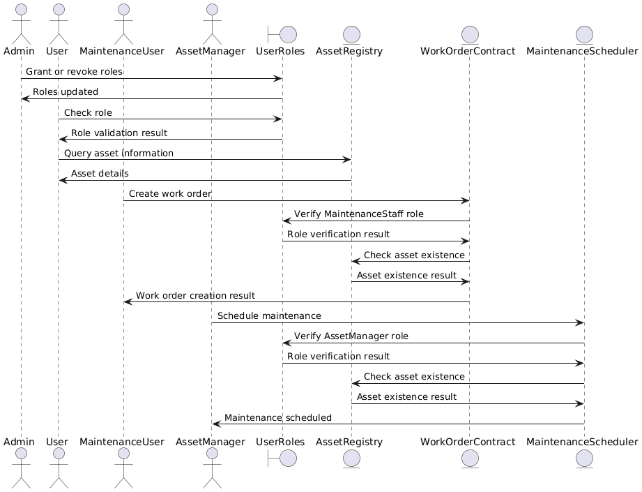

# Asset Management and Maintenance System on Blockchain

## Overview

This project implements a blockchain-based asset management system. It includes contracts for managing user roles, assets, work orders, and maintenance schedules, designed to be used in industries like oil and gas or aviation.



## Smart Contracts

### 1. `UserRoles.sol`
Manages user roles in the system, including:
- `ASSET_MANAGER_ROLE`: For managing assets and maintenance schedules.
- `MAINTENANCE_STAFF_ROLE`: For managing work orders.

#### Integration with `AccessControl`
- **`AccessControl`:** Provides a granular role-based access control mechanism, allowing multiple roles with specific permissions. This helps manage complex permissions and ensures security in operations.

### 2. `AssetRegistry.sol`
Registers and manages assets, storing details and conditions for asset transfers. Access is controlled by the `ASSET_MANAGER_ROLE`. This contract integrates with:
- `UserRoles`: To verify roles for asset management.
- `AssetMetadata`: To manage additional metadata for assets.
- `OwnershipContract`: To handle asset ownership records and transfers.
- `TransferConditions`: To define and enforce conditions for asset transfers.

#### ERC-721 Standard
`AssetRegistry` utilizes the ERC-721 standard, a popular non-fungible token (NFT) standard on Ethereum, allowing each asset to be represented as a unique token. This ensures that assets are distinguishable and can be transferred securely.

#### Integration with `Ownable`
- **`Ownable`:** The `AssetMetadata`, `OwnershipContract`, and `TransferConditions` contracts use `Ownable` to set an owner who can perform critical administrative tasks. This ensures that only authorized entities can manage critical aspects of the contract. In this case, `AssetRegistry` is the owner of these contracts.

### 3. `WorkOrderContract.sol`
Handles the creation, updating, and retrieval of work orders for assets. Access is controlled by the `MAINTENANCE_STAFF_ROLE`.

### 4. `MaintenanceScheduler.sol`
Allows scheduling, updating, and retrieving maintenance schedules for assets. Access is controlled by the `ASSET_MANAGER_ROLE`.

## Truffle Framework

Truffle is a popular development framework for Ethereum that provides a suite of tools for developing and testing smart contracts. Below are details on how Truffle is used in this project:

### Migrations

Migrations in Truffle are JavaScript files that help you deploy contracts to the Ethereum blockchain. Each migration file is responsible for deploying one or more contracts and tracking their state.

- **Migration Scripts:** Located in the `migrations` folder, these scripts use Truffle's built-in commands to deploy contracts.

### Artifacts

Truffle generates artifacts for each compiled contract, which include the contract's ABI (Application Binary Interface), bytecode, and deployed address. These artifacts are essential for interacting with the contracts via JavaScript or other programming languages.

- **Artifacts Location:** Generated artifacts are stored in the `build/contracts` directory. Each file corresponds to a smart contract and is named after the contract with a `.json` extension, containing detailed information about the contract.

### Testing

Truffle provides a testing environment that supports both JavaScript and Solidity tests. Tests are located in the `test` directory and are used to ensure that the smart contracts behave as expected.

- **JavaScript Tests:** Utilize the Mocha testing framework and Chai assertion library. These tests simulate contract interactions and check for correct behavior.

## Getting Started

### Prerequisites

- [Node.js](https://nodejs.org/) and [npm](https://www.npmjs.com/)
- [Truffle framework](https://www.trufflesuite.com/truffle)


### Installation

1. **Install Dependencies:**

     - [OpenZeppelin Contracts](https://openzeppelin.com/contracts/)
    
    - [OpenZeppelin Test Helpers](https://docs.openzeppelin.com/test-helpers/)

    ```sh
    npm install
    ```

2. **Run Truffle's Development Network:**
    - [Truffle Quickstart](https://archive.trufflesuite.com/docs/truffle/quickstart/)

    ```sh
    npx truffle develop
    ```

3. **Compile Contracts:**

    Inside the Truffle console, run:

    ```sh
    compile
    ```

4. **Deploy Contracts:**

    Inside the Truffle console, run:

    ```sh
    migrate
    ```

5. **Run Tests:**

    Inside the Truffle console, run:

    ```sh
    test
    ```

    Alternatively, outside the Truffle console, use:

    ```sh
    npx truffle test
    ```

## Optimization and Gas Efficiency

### Optimization Techniques

- **Function and varibale Visibility:** Limited access to functions and variables to reduce unnecessary state changes and interactions.

- **Function modifier:**  Used view where applicable to ensure functions only read from the blockchain state without modifying it.

- **State Variables:**  Used memory and calldata instead of storage where possible to minimize gas costs.

- **Data Structures:** Optimized data structures for performance and cost, such as using mappings for efficient lookups rather than arrays.


## Security and Attack Prevention

### Security Considerations


1. **Access Control**
   - **Mitigation:** Role-based access using `AccessControl`.
   - **Example:** `ASSET_MANAGER_ROLE` restrictions.

2. **Added Modifiers**
   - **Purpose:** Custom modifiers are used to encapsulate common checks and ensure code reusability.
   
3. **Added `require` Statements**
   - **Purpose:** `require` statements are used to enforce conditions and validate inputs before executing critical operations.


